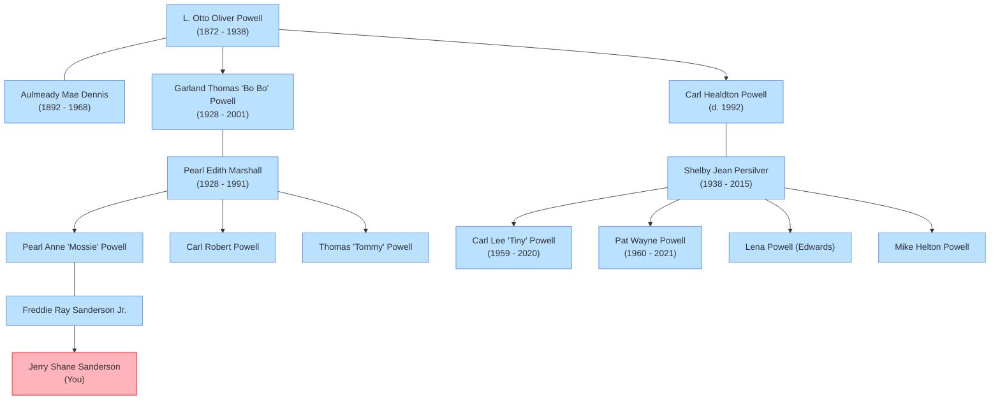

# 🌳 Sanderson & Powell Family Tree Project

Welcome to your family tree backup and research repository. 

When you view this repository on GitHub, the diagram below will automatically render into an interactive graphical chart showing your ancestral branches and descendants!

---

## 📍 Family Tree Diagram

---

## 🗂️ Project Directory Files

*   **Database:** [sanderson_tree.json](sanderson_tree.json) — Complete JSON database containing all 221 individuals and relationships.
*   **Visual Web App:** [family-tree-app/](family-tree-app/) — A React + Vite interactive family tree application.
*   **Research Reports:**
    *   [carl_powell_descendants.md](carl_powell_descendants.md) — Comprehensive report on Carl Helton Powell's descendants.
    *   [KRAKEN_MASTER_DOSSIER.md](KRAKEN_MASTER_DOSSIER.md) — Active OSINT intelligence dossier on key targets.
